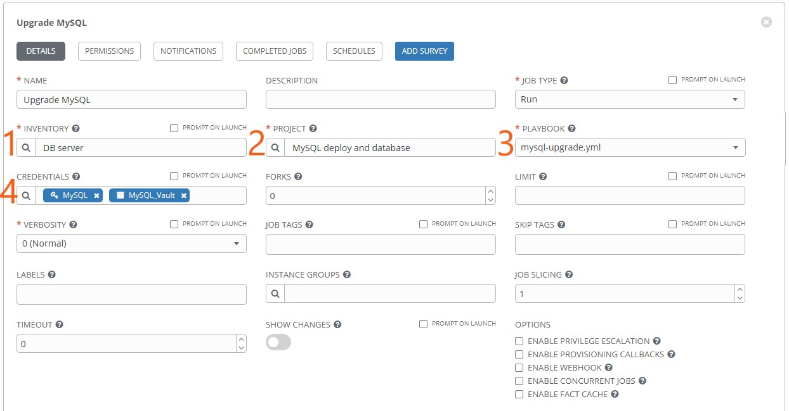
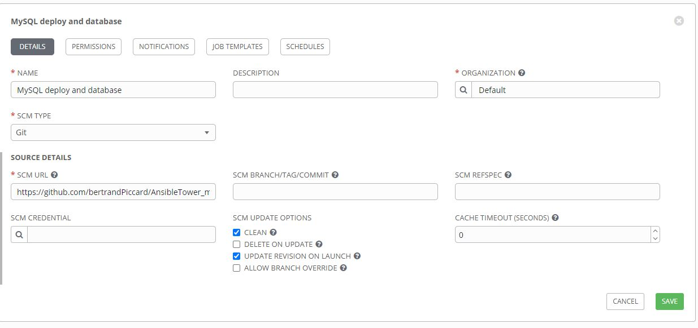

# Ansible

[Official documentation](https://docs.ansible.com/ansible/latest/index.html)

## About this repo

There are 2 playbooks:

- **mysql-playbook**: That uses a role from [geerlingguy](https://github.com/geerlingguy/ansible-role-mysql), which install MySQL on almost any kind of OS and a second role that creates a database and fill it data.
- **mysql-upgrade**: It uses mysql-upgrade role to uninstall and install a specific version of MySQL.

Roles:

- **geerlingguy.mysql**: Root password has to be specified in _default/main.yml_
- **mysql**: Data for the database is in _files/dump.sql_. Ansible Vault is used to encrypt _vars/main.yml_, pwd is "admin".
- **mysql-upgrade**: Contains only all the task for uninstalling and reinstalling MySQL on CentOS in _tasks/main.yml_

This repo can be used directly as a project in Ansible Tower, but when using Ansible the roles have to be contained in "~/.ansible/roles" folder (by default) or the path has to be specified in "/etc/ansible/ansible.cfg" file.

## Basics

Ansible is an IT automation engine that automates cloud provisioning, configuration management, application deployment, intra-service orchestration, and many other IT needs.

It uses no agents and no additional custom security infrastructure, so it's easy to deploy - and most importantly, it uses a very simple language (YAML, in the form of Ansible Playbooks) that allow you to describe your automation jobs in a way that approaches plain English.

Architecture :


- Host inventory: Ansible uses an inventory file to keep track of which hosts are part of your infrastructure, and how to reach them for running commands and playbooks. Hostname or IP can be specify in the "host" file, located in "/etc/ansible". Example:

```
[webservers]
203.0.113.111
203.0.113.112

[dbservers]
203.0.113.113
server_hostname
```

- Playbook: Ansible Playbooks are the way of sending commands to remote systems through scripts. Ansible playbooks are used to configure complex system environments to increase flexibility by executing a script to one or more systems. Example:

```
- name: update web servers
  hosts: webservers
  remote_user: root

  tasks:
  - name: ensure apache is at the latest version
    yum:
      name: httpd
      state: latest
  - name: write the apache config file
    template:
      src: /srv/httpd.j2
      dest: /etc/httpd.con
```

Command to run `ansible-playbook myplaybook.yml`

- Roles: Roles are a collection of tasks, which can be moved from one playbook to another, can be run independently but only through a playbook file. Structure:

```
`-- myRole
    |-- defaults
    |   `-- main.yml
    |-- files
    |   `-- data
    |-- handlers
    |   `-- main.yml
    |-- meta
    |   `-- main.yml
    |-- tasks
    |   `-- main.yml
    `-- vars
        `-- main.yml
```

**defaults**: default variables for the role.

**files**: all files that needs to be copied to the remote host are located here. It is not required to specify a path for resources stored in this directory.y.

**handlers**: contains handlers, which can be invoked by “notify” directives and are associated with service.

**meta**: metadata for the role such as its author, support platforms and dependencies.

**tasks**: the main list of tasks that the role executes.

**vars**: other variables for the role and have a higher priority that the default directory.

Ansible Galaxy:
Ansible Galaxy refers to the Galaxy website where users can share roles, and to a command line tool for installing, creating and managing roles. Check [here](https://galaxy.ansible.com/?extIdCarryOver=true&sc_cid=701f2000001OH7YAAW).

## Ansible Installation

[Official documentation](https://docs.ansible.com/ansible/latest/installation_guide/intro_installation.html#installing-ansible-on-ubuntu)

### Ubuntu

> sudo apt update

> sudo apt install software-properties-common

> sudo apt-add-repository --yes --update ppa:ansible/ansible

> sudo apt install ansible

Host and ansible.cfg are located in "/etc/ansible" and roles in "~/.ansible/roles".

### Setup SSH connexion

A ssh connexion has to be made on the node before running a playbook using that host.

> sudo apt-get install openssh-server

> sudo systemctl enable ssh

> sudo systemctl start ssh

> ssh root@192.168.0.1

### Dealing with Windows Nodes

[Doc](https://docs.ansible.com/ansible/latest/user_guide/windows_winrm.html)

Unlike Linux/Unix hosts, which use SSH by default, Windows hosts are configured with WinRM. Also make when using roles or module that it is compatible with Windows node. Python module cannot be executed through WinRM, it requires it equivalent for Windows in powershell.

> pip install "pywinrm>=0.3.0"

#### Authenfication options

When connecting to a Windows host, there are several different options that can be used when authenticating with an account. The authentication type may be set on inventory hosts or groups


Basic: Create a local account on the Windows machine and specify the following variables:

```
[win]
192.168.0.102

[win:vars]
ansible_user=admin
ansible_password=admin
ansible_connection=winrm
ansible_winrm_server_cert_validation=ignore
```

Here the variables are defined in the "hosts" file, but it is recommended to use the folder dedicated for the variables, also because the file can be encrypted with Ansible Vault to hide the sensible information such as password.

> ansible win -m win_ping

```
192.168.0.102 | SUCCESS => {
    "changed": false,
    "ping": "pong"
}
```

Playbook to install Chocolatey on Windows node:

```
- hosts: win
  gather_facts: no
  tasks:
   - name: Install
     win_chocolatey: name=procexp state=present
```

## Ansible Vault

Ansible Vault encrypts variables and files so you can protect sensitive content such as passwords or keys rather than leaving it visible as plaintext in playbooks or roles. To use Ansible Vault you need one or more passwords to encrypt and decrypt content. [More](https://docs.ansible.com/ansible/latest/user_guide/vault.html)

Create a new encrypted file:

```
ansible-vault create vars/main.yml
> Enter Vault password:
```

Edit the file directly:

```
ansible-vault edit vars/main.yml
> Enter Vault password
```

The main.yml encrypted with Vault contains key pair value of the information, here an example:

```
--- # Specify the begin of the file, not compulsory
admin_password: admin
ssh_public_key: SHA-029d2093kd
```

Use it in _tasks/main.yml_:

```
---
- name: Create Admin User
  user: name=admin password={{ admin_password }} groups=sudo
```

The command for a playbook using the Vault encrypted file:

> ansible-playbook myplaybook.yml --ask--vault-pass

## Ansible Tower

Ansible Tower (formerly ‘AWX’) is a web-based solution that makes Ansible even more easy to use for IT teams of all kinds. It’s designed to be the hub for all of your automation tasks. [More](https://docs.ansible.com/ansible/2.5/reference_appendices/tower.html)

Here we are using the Trial [version](https://www.redhat.com/en/technologies/management/ansible/try-it?extIdCarryOver=true&sc_cid=701f2000001OH7YAAW). Set up an account and get the 60 days trial.

Supported OS:

- Supported Operating Systems:
- Red Hat Enterprise Linux 8.2 or later 64-bit (x86)
- Red Hat Enterprise Linux 7.7 or later 64-bit (x86)
- CentOS 7.7 or later 64-bit (x86)

Browser:

- Google Chrom
- Mozilla Firefox

Hardware:

- 2 CPUs minimum
- 4 GB RAM minimum
- 20 GB of dedicated hard disk space

### Installation on CentOS7

First download the trial from the link in Red Hat's mail.

Create a temp folder and copy the .tar file from the download:

> mkdir /tmp/tower && cd /tmp/tower

Extract the archive:

> tar xvf ansible-tower-setup-latest.tar.gz

Go the setup folder and modify the inventory file

> cd ansible-tower-setup\*/ && nano inventory

Here add strong password for:

- admin_password
- pg_password
- automationhub_pg_password

And last command to start the installation:

> sudo ./setup.sh

All the installation is done by playbooks and it will take some time to complete. At the end access in the web browser with the IP address.

### Concepts

- **Templates**: It is the environment containing all the configurations (Credentials, Inventory, Project) and will be run by the agent.
- **Credentials**: It contains the information for different type of connexion or password, for SSH connexion or Ansible Vault.
- **Project**: That’s where the playbook and roles are contained. It also possible to get a project from GitHub or other version control system or even imported manually.
- **Inventories**: As view previously, it contains all the managed node IP or hostname.

### Templates

Here is an example of templates:


1. Specify the inventory to use, all our host are defined in this.

2. Project to use for the templates, projects contains playbook and roles

3. Specify the playbook to use in from the project.

4. Credentials are used for authentification and here in this case as we are using Ansible Vault, we had to make a credentials especially for that, so we don't have to enter passwork when running the job.

### Use Git Hub repository as project

Here is an example of project that use my GitHub repository:

